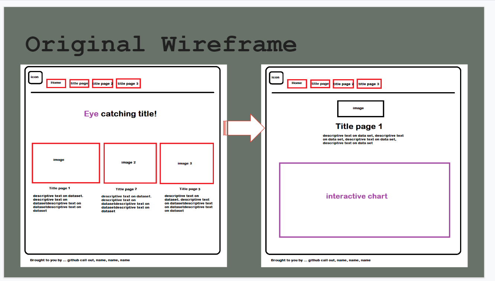
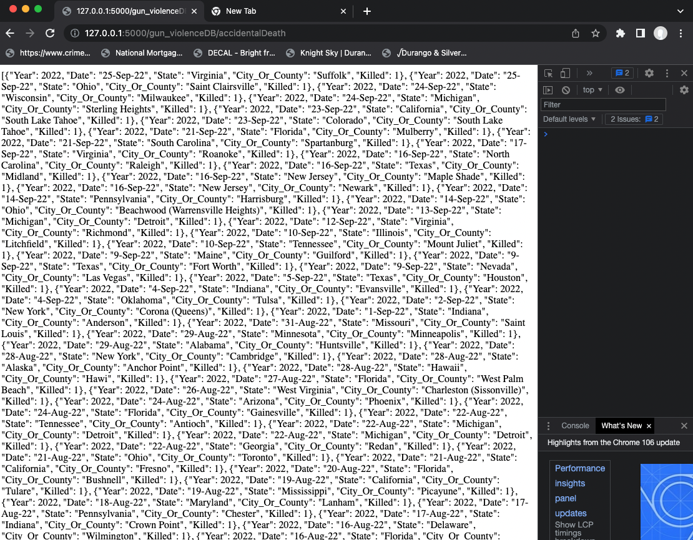
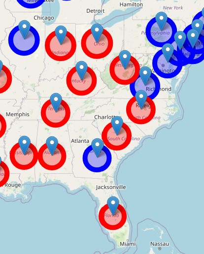
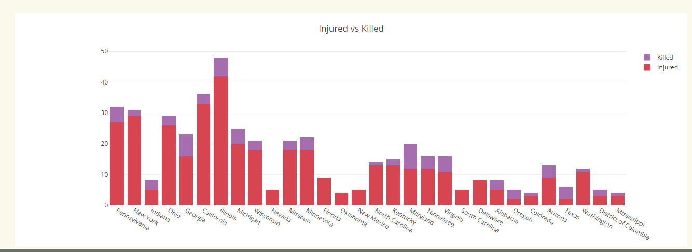

# Project 3 | Group E
## Gun Violence in America

### Description:

We all know that gun violence in the US is prevalent, but is gun violence getting worse over the years? For our project, we will use an interactive  dashboard to show viewers the impact that guns have had over the years across the US. How has the pandemic impacted gun violence? Has gun violence increased in a certain state, and does being a red state or a blue state affect their safety from the dangers of guns? Our goal is to create a visual presentation of the data that we find to answer these questions.

### Project Website
<a href= "https://aimeevu.github.io/project-3-group-e/templates/index.html">Click Me To Enter Our Site</a>

### Detailed Slide Presentation
<a href= "https://docs.google.com/presentation/d/1w0D63aHJv9MmNJ9_1C4eheo7YGbr6smnntOjoIW29xI/edit#slide=id.g15d964c9d0f_0_11">Click Me To View Our Presentation</a>

### Group Members:

* <a href="https://github.com/sesu0722">Selina</a>
* <a href="https://github.com/Ariwodo16">Mike Ariwodo</a>
* <a href="https://github.com/WMatthewARC">William M</a>
* <a href="https://github.com/aimeevu">Aimee V</a>
* <a href="https://github.com/jlmamp">Jarvis L</a>
* <a href="https://github.com/vertta">Vertta M</a>
* <a href="https://github.com/pradipraodeo">Pradip</a>
* <a href="https://github.com/vkk125">Valentina Z</a>
* <a href="https://github.com/jdellinger80">James D</a>
* <a href="https://github.com/GigiSchulte">Gina S S</a>

### Datasets:

* <a href="https://www.gunviolencearchive.org/mass-shooting">Gun Violence Archive: Mass Shootings</a>
* <a href="https://www.safehome.org/data/firearms-guns-statistics/#police">Safehome: Police Firearms Gun Statistics</a>
* <a href="https://www.gunviolencearchive.org/accidental-injuries">Gun Violence Archive: Accidental Injuries</a>
* <a href="https://www.gunviolencearchive.org/accidental-deaths">Gun Violence Archive: Accidental Deaths</a>
* <a href="https://worldpopulationreview.com/state-rankings/gun-ownership-by-state">Gun Ownership By State</a>
* <a href="https://en.wikipedia.org/wiki/Political_party_strength_in_U.S._states">Political Party Strength in US States</a>

### Database:

For this project, we decided to use MongoDB for our database.

### Tasks:

* Set up database - Vertta/Selina
* Clean data - James Dellinger
* Flask API - William
* HTML/CSS frame of website - Gina/Aimee
* Interactive Map - Valentina/Michael
* Drop Down Charts - Selina/Michael/Jarvis
* PowerPoint Presentation - (Done by Tuesday) - Aimee/Pradip/William

### Sketch:

### ETL Methodology Used:
* Data was  pulled into a Jupyter notebook and cleansed using python to ensure the dataset had consistency across data sets . The date chosen were after 2019.  
* Fields Needed For Charts - # Killed, # Injured, State, Year
* Fields Needed For Map - State, Gun Ownership Percentage

### Flask Application Overview:

### Decorating The Site:

https://coolors.co/334bff-4d2d52-f4d58d-697268-d64550

### Visualizations

* Gun ownership by State - Interactive map

* Injured vs Killed visualization

